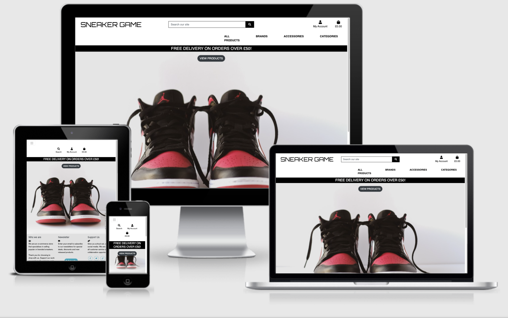

  <h1 align="center">Django E-Commerce Project - Sneaker Game </h1>
 
  <h1 align="center">SneakerGame</h1>

# Purpose:
"SneakerGame" is a wavy fashion e-commerce website that allows shoppers to browse, search for and purchase the most popular sneakers and accessories.

The object of this project is to utilize the Django framework to implement an e-commerce website that aids swift development without compromising on security. This allows the user to register an account and log in to confirm the order. In addition, the website records the customer's shopping cart so that the customer can see the next potential purchase. In addition, the site uses the Stripe API  to enable customers to complete their purchases and securely store payment information for future orders
# User Experience (UX)

## Strategy: 
This website will allow users to browse and purchase the latest sneakers. The sneaker reseller market has exploded within the last few years due to the increased capabilities of bots that purchase sneakers on release dates. These bots are designed to purchase sneakers quicker than a human can navigate through the retailer's website, as it's first come first served basis, these bots beat humans to the purchase. This has led to resellers taking advantage of this new technology and selling sneakers that retail stores cannot get a hold of. The purpose of this site is for resellers to advertise and sell their sneakers.

A user can register an account to set their user profile. There is also an Admin profile that acts as a superuser and can view all orders and also can add/remove items from the database. The navigation bar has been separated into specific items to allow the user to view products swiftly. There is also a search bar included within the navbar which will search the whole site for any related keywords. When viewing products, a filter has been included to view items within a specific criteria.  

-	### User stories
-	User (Customer)
	-	As a user, I would like to view the latest sneakers
	-	As a user, I would like to filter sneakers by brand 
	-	As a user, I would like to filter by price
	-	As a user, I would like to filter by rating 
	-	As a user, I would like to view product details
	-	As a user, I would like to place items into the shopping basket
	-	As a user, I would like to purchase items in my shopping basket
	-	As a user, I would like to confirm the deletion of items from the basket
	-	As a user, I would like to place to increase/decrease the quantity 
	-	As a user, I would like to register an account
	-	As a user, I would like to log into my account
- Admin (Super User)
	-	As an admin, I would like access to the Product Management page
	-	As an admin, I would like to ability to delete a user account
	-	As an admin, I would like the ability to perform CRUD operations on Products, Brands and Categories 
		-	CRUD - Create, Read, Update, Delete

## Scope:
The application has a set of categories and brands that are restricted by the admin user. This is to ensure when adding a product that only relevant items are assigned to the product. In the event of a new product being added to the site, the relevant category/brand will have to be stored within the database in order to store the product correctly. For example, if the admin wanted to add a new product 'Nike Air Max 90' (men's sneaker), the admin user will have to ensure that the drop-down items on the admin form have the correct category and brand options that suit the sneaker. Category/Brand can be added manually through the admin panel. Once added, the items would be included within the products drop-down fields.
## Structure:
To enable consistency throughout the application, the Python template engine of "Jinja" was used to help structure the HMTL pages. Jinja is a modern-day templating language for Python developers. Jinja templates include inheritance which is used to prevent repeated code. This saves a lot of time and reduces work. A base template contains the basic layout which is common to all the other templates. This is beneficial as it provides a level of consistency throughout the application structure.

## Skeleton:
Before the development of the project, I sketched out my initial idea in Balsamiq Wireframes to provide a visual representation of what the application will look like. This has helped when creating the application as it allowed for a guide to follow during development. 

## Surface:
My initial thought when designing the surface of the website was to theme the quiz to match an arcade type game. This meant including live backgrounds, funky fonts and a qwerky colour scheme. Here is how I went about achieving this:

### Front-end Framework -  [Bootstrap](https://getbootstrap.com/)
-	The front-end framework of Bootstrap was used to build the styling components of the application. Bootstrap does a lot of the heavy lifting for you and provides default stylings that speed up the development process.

### Custom Font -  [Google Fonts](https://fonts.google.com/specimen/Orbitron?query=Orbitron)
-  The font class from google called "Orbitron", Designed by Matt McInerney was used for page headings.

### Glass Cards-  [Glassmorphism](https://hype4.academy/tools/glassmorphism-generator)
-   This generator was used to create the background styling for the card components on the application. It was simple to use and provided CSS that's required for the desired effect.

### Soft UI (Footer)-  [Glassmorphism](https://neumorphism.io/#e0e0e0)
-   This CSS generator was used to create a simple footer with shadow effects

## Features
-	Responsive UI/UX
-   Website purpose immediately communicated and understood
-   Navigation bar
-   Side-Nav Sorting functionality
-   Registration & Login functionality
-   Search functionality
-   Log out functionality
-   Sorting functionality
-   Product details
-   Checkout functionality
## Technologies Used

### Languages/Frameworks Used
 1. HTML 

 2. CSS 
 3. Bootstrap  

 4.  JavaScipt

 5.    Python
 6.     Django
 

### Frameworks, Libraries & Programs Used

1.  [Django:](https://www.djangoproject.com/)
-   Django is a high-level Python web framework that encourages rapid development and clean, pragmatic design with the use of templates.

2.  [Google Fonts:](https://fonts.google.com/)

-   Google fonts were used to import the 'Ubuntu Condensed' font into the style.css file which is used on all pages throughout the project.

3.  [Font Awesome:](https://fontawesome.com/)

-   Font Awesome was used on all pages throughout the website to add icons for aesthetic and UX purposes.

4.  [jQuery:](https://jquery.com/)

-   jQuery came with Bootstrap to aid the framework interactive features.

5.  [Git](https://git-scm.com/)

-   Git was used for version control by utilizing the Gitpod terminal to commit to Git and Push to GitHub.

6.  [GitHub:](https://github.com/)

-   GitHub is used to store the project's code after being pushed from Git.

7.  [Balsamiq:](https://balsamiq.com/)

-   Balsamiq was used to create the  [wireframes](https://github.com/shaff600/SneakerGame/tree/main/docs/wireframes)  during the design process.

# Testing
Testing was done throughout the project via chrome development tools. I also used various code validators to make sure my code was free of errors.
    
###	Testing User Stories from User Experience (UX) Section

-	User (Customer)
	-	As a user, I would like to locate different site pages through the navigation panel
	-	As a user, I would like to view the latest sneakers
	-	As a user, I would like to filter sneakers by brand 
	-	As a user, I would like to filter by price
	-	As a user, I would like to filter by rating 
	-	As a user, I would like to view product details
	-	As a user, I would like to place items into the shopping basket
	-	As a user, I would like to purchase items in my shopping basket
	-	As a user, I would like to confirm the deletion of items from the basket
	-	As a user, I would like to place to increase/decrease the quantity 
	-	As a user, I would like to register an account
	-	As a user, I would like to log into my account
- Admin (Super User)
	-	As an admin, I would like access to the Product Management page
	-	As an admin, I would like to ability to delete a user account
	-	As an admin, I would like the ability to perform CRUD operations on Products, Brands and Categories 
		-	CRUD - Create, Read, Update, Delete

## Manual Testing

 ### As a user, I would like to locate different site pages through the navigation panel 

TEST            | OUTCOME                          | PASS / FAIL  
--------------- | -------------------------------- | ---------------
All Products| Filtering options are displayed, filtered by Price, Rating, Category and All Products| PASS
Brands | Filtering options are displayed, filter by Nike, Jordan, Off-White, Bearbrick and All Brands | PASS
Accessories| Filtering options are displayed, filter by Shoe Care, Collectables, Caps and Bags | PASS
Categories| Filtering options are displayed, filter by Men's, Women's, Kids, All| PASS
My Account| Product Management (SuperUser access), Register and Login options are visible | PASS
Text|Checked if all fonts and colours used are consistent or not|PASS

 ### As a user, I would like to register an account

TEST            | OUTCOME                          | PASS / FAIL  
--------------- | -------------------------------- | ---------------
Click "Register" | on click page is redirected to Register page | PASS
Form Validation| Submit the form with partial entries | PASS
Enter valid data| On form submission, a verification e-mail is produced| PASS

 ### As a user, I would like to log into my account

TEST            | OUTCOME                          | PASS / FAIL  
--------------- | -------------------------------- | ---------------
Click "Login" and enter invalid credentials| on click, error message is displayed | PASS
Form Validation| Submit the form with partial entries | PASS
Enter valid data| On form submission, the page is redirected to homepage| PASS

###	As a user, I would like to view the latest sneakers
TEST            | OUTCOME                          | PASS / FAIL  
--------------- | -------------------------------- | ---------------
Click "All Products"| All Products are displayed | PASS
 
###	As a user, I would like to filter sneakers by brand 
TEST            | OUTCOME                          | PASS / FAIL  
--------------- | -------------------------------- | ---------------
Click "Brands" on navbar | options available for different brands| PASS
Enter specific brand in search bar| Number of results listed  | PASS

###	As a user, I would like to filter by price
TEST            | OUTCOME                          | PASS / FAIL  
--------------- | -------------------------------- | ---------------
Click "All Products"| All Products are displayed | PASS
Select Price(Low to High) | Filter is applied to products | PASS
Select Price(High to Low) | Filter is applied to products | PASS

###	As a user, I would like to filter by rating 
TEST            | OUTCOME                          | PASS / FAIL  
--------------- | -------------------------------- | ---------------
Click "All Products"| All Products are displayed | PASS
Select Rating (Low to High) | Filter is applied to products | PASS
Select Rating (High to Low) | Filter is applied to products | PASS

###	As a user, I would like to view product details
TEST            | OUTCOME                          | PASS / FAIL  
--------------- | -------------------------------- | ---------------
Click "All Products"| All Products are displayed | PASS
Select a Product| Page is redirected to Product Detail page| PASS

###	As a user, I would like to place items into the shopping basket
TEST            | OUTCOME                          | PASS / FAIL  
--------------- | -------------------------------- | ---------------
Select a Product| Page is redirected to Product Detail page| PASS
Click "Add To Bag" | Item is placed in basket | PASS

###	As a user, I would like to purchase items in my shopping basket
TEST            | OUTCOME                          | PASS / FAIL  
--------------- | -------------------------------- | ---------------
Click "Secure Checkout"| Page is redirected to checkout entry page | PASS
Form Validation| Submit the form with partial entries | PASS
Enter valid data (Sample Stripe Data)| On form submission, the page is redirected to order confirmation page| PASS

###	As a user, I would like to confirm the deletion of items from the basket
TEST            | OUTCOME                          | PASS / FAIL  
--------------- | -------------------------------- | ---------------
Click "Delete" on basket item | button does not work | FAIL
Update J Query Version| Item can now be removed| FAIL

###	As a user, I would like to place to increase/decrease the quantity 
TEST            | OUTCOME                          | PASS / FAIL  
--------------- | -------------------------------- | ---------------
Click + on bag item| Quanitity for item is updated| PASS
Click - on bag item| Quanitity for item is updated| PASS

###	As an admin, I would like access to the Product Management page
TEST            | OUTCOME                          | PASS / FAIL  
--------------- | -------------------------------- | ---------------
Login with SuperUser credentials| "Product Management" page is displayed under "My Account"| PASS

###	As an admin, I would like to ability to delete a user account
TEST            | OUTCOME                          | PASS / FAIL  
--------------- | -------------------------------- | ---------------
Naviagte to the admin URL ("/admin/")| Admin login page is populated | PASS
Locate user account and click "delete"| Confirmation message pop up generated, user, deleted | PASS

###	As an admin, I would like the ability to perform CRUD operation on Products, Brands and Categories 
TEST            | OUTCOME                          | PASS / FAIL  
--------------- | -------------------------------- | ---------------
Navigate to "Product Management" on Nav Bar| On click, the page is redirected| PASS
Form Validation| Submit the form with partial entries | PASS
Enter valid data| On form submission, the page is redirected to products page| PASS
On admin screen, update product details| Product is updated | PASS
On admin screen, delete product | Product is deleted | PASS
On admin screen, add new brand item via form | Brand is added | PASS
On admin screen, add new category item via form | Category is added | PASS
On admin screen, update category item via form | Category is updated | PASS

## Validators

The code included for this project has been inputted into W3C HTML Validator, W3C Validator, JSHint Validator and a PEP8 Validator. Within the HTML Validators, there were some fails regarding the Django templating that's been used however there were no HTML errors. 
# Summary
   -   As a result of running the validator for the HTML, it was shown that the Jinja templating language was causing issues however this is expected as the tool is not recognising the templating language. When carrying out testing there was an issue with the product delete button when at basket view, a new JQuery URL was used which worked, I believe I was using the "slim" version which doesn't include the full functionality JQuery offers.
  ###	Known Issues
  -	Currently, there isn't any functionality in place for a user to manage their orders. A user can view orders but cannot make amendments
  -	"Latest Stock" has not been implemented. Ideally wanted a section on the side that displays the latest items.
  -	"Featured Product" has not been implemented. This could have been used under the product detail page where the site suggests items based on the selected product. 
  -	
  ###	Future Development 
  - I would like to implement Latest Stock and Featured Product to make the e-commerce website complete. 
  - Explore alternative CSS frameworks that could enhance the look and feel. 
  - Implement timed modals i,e a pop up box that appears 15seconds into the user's session that offers a discount if they sign up
  - Landing page slideshow
  - Include a larger dataset for the website
  - Implement a variety of different product images with zoom functionality  
   
## Deployment
###	Forking the GitHub Repository

Forking a repository enables us to make a copy of the original repository on our GitHub account so we can view it and make changes without affecting the original work.
This is done using the following steps:
 1. Log in to [GitHub](https://github.com/shaff600) account and select the relevant repository.
 2. To the top right of the page there are three buttons, the furthest right says **Fork.** Click on this button.
 3. A copy of the original repository will now be in your account.
###	Making a Clone
To make a clone of my project use the following steps:
 1. Go to my [account](https://github.com/shaff600) and locate the relevant repository.
 2. Next to the green **Gitpod** button, click on **CODE.**
 3. Click on **Download Zip.**
 4. Once downloaded, you can extract the zip file's contents and save it to a desktop and run the website locally.

 ### Setting up the app
 - Within you work inviroment terminal:
    - Install requirements file, enter. 'pip install -r requirements.txt' in the terminal 
    - Import data
	    - "python3 manage.py loaddata categories.json"
		    - ensure this import is loaded first as brands and product rely on the relationship 
		- "python3 manage.py loaddata brands.json"
		- "python3 manage.py loaddata products.json"
		- Create a Super User to gain Admin access
			- "python3 manage.py createsuperuser
			- Enter credentials 
			- Navigate to "/admin/ URL on local host
  
**Create Heroku application:**

1.  Signed into Heroku
2.  Created a new app by clicking the "new" button.
3.  Select the new app
4.  Created the app project name
5.  In the resources tab, provision a new Postgres database.
7.  To use Postgres, in the gitpod terminal install dj_database_url (pip3 install dj_database_url) and psycopg2 (pip3 install psycopg2-binary)

**Setup AWS S3 Bucket:**

1.  Created an AWS account
2.  Went into the management console
3.  Selected S3
4.  Named a bucked related to the project
5.  Selected the closest region
6.  Allowed public access to the bucket, config changes required 
7.  Within the properties tab switched on static website hosting
8.  Within the permissions ta, pasted the CORS configuration which allows access between the Heroku app and the S3 bucket.
9.  Created a security policy for the S3 bucket using the built-in policy generator
10.  Set Action as "GetObject", copy and paste the unique ARN
11.  Copied the generated policy into the bucket policy editor
12.  Went onto the access control tab and sekected the public access item

## Credits

### Sources 
-	During the development process I have referred to Project Ado for inspiration and guidance. The walkthrough project provided a detailed step by step process on how to approach developing an e-commerce store.
-	Here are a few YouTube videos I have referred to whilst in the development process
	-	Django E-commerce Store
		-	https://www.youtube.com/watch?v=VG0QAhhsMTo 
	-	Django and Juliette
		-	https://www.youtube.com/watch?v=C1nx-R4Jegs	

### Acknowledgements
- A special mention to the CI support team who have guided me on how to approach troubleshooting issues in development. During the early stages of the project, I was able to conversate on how other students have approached similar projects which have helped loads.
- During my 2-week development cycle, my allocated mentor provided comprehensive feedback throughout our calls as well as being a motivating ear during my development process

